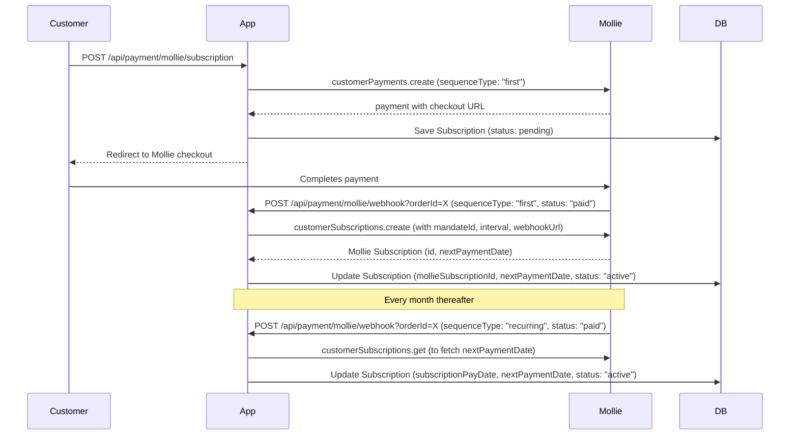

# Design Document: Mollie Subscription Renewal Fix

## Overview

This document describes the fixes required to make Mollie recurring subscription payments work correctly. The core problem is that after a customer's first payment, the system fails to create a valid Mollie subscription, and even when a subscription exists, the webhook handler does not persist status updates correctly. Additionally, the subscription management endpoint overrides the database status with a time-based calculation that locks out customers regardless of actual payment state.

The fix touches three files: `models/Subscription.js`, `controllers/payments.js`, and `getSubscriptionManagement` within the same controller. A diagnostic script is also added to `scripts/`.

## Architecture

The subscription lifecycle follows this flow:



## Components and Interfaces

### 1. Subscription Model (`models/Subscription.js`)

Adds missing fields that the controller already references but that are absent from the schema.

**Changes:**

- Add `paymentFailCount: { type: Number, default: 0 }`
- Add `cancelDate: { type: Date }`
- Expand `subscriptionStatus` allowed values to include `"payment_issue"` and `"payment_overdue"`

### 2. Webhook Handler — First Payment (`controllers/payments.js`)

The `processMollieWebhook` function's `sequenceType === "first"` branch.

**Current bugs:**

- Passes `startDate: payment.nextPaymentDate` — this field does not exist on the Payment object, so `startDate` is always `undefined`
- After the try/catch for subscription creation, reads `mollieSubscription.nextPaymentDate` unconditionally — if creation failed, `mollieSubscription` is `undefined` and this throws, skipping `subscription.save()`
- Uses a non-lean `subscription` document but then calls `subscription.save()` inside a try/catch that may have already thrown

**Fix:**

- Remove `startDate` from the `customerSubscriptions.create` call entirely — Mollie will schedule the first recurring charge based on the mandate date
- Guard `mollieSubscription.nextPaymentDate` access behind a null check
- Ensure `subscription.save()` is always called regardless of whether Mollie subscription creation succeeded or failed

### 3. Webhook Handler — Recurring Payment (`controllers/payments.js`)

The `payment.subscriptionId && payment.sequenceType !== "first"` branch.

**Current bugs:**

- Calls `Subscription.findOne(...).lean().exec()` — returns a plain JS object, not a Mongoose document
- Updates `subscription.nextPaymentDate` on the plain object but never calls `.save()` or `findOneAndUpdate`
- The status update (`subscriptionStatus: "active"`) happens in the later general block, but only if `subscription.subscriptionStatus !== "active"` — meaning if it was already active it won't update `nextPaymentDate`

**Fix:**

- Remove the separate recurring-payment block entirely — the general block at the bottom already handles `payment.status === "paid"` → `subscriptionStatus: "active"` and fetches `nextPaymentDate` from Mollie. The recurring block is redundant and broken.
- Ensure the general block's `nextPaymentDate` fetch runs for all paid subscription payments (not just when `subscription.mollieSubscriptionId` is set — it should also check `payment.subscriptionId`)

### 4. `getSubscriptionManagement` (`controllers/payments.js`)

**Current bug:**

- Loops through all subscriptions and forcibly sets `subscriptionStatus = "payment_overdue"` if `subscriptionPayDate` is >31 days ago, completely ignoring `nextPaymentDate`
- This overrides the DB value in memory before returning it to the frontend

**Fix:**

- Remove the `subscriptions.forEach` block that mutates status based on date math
- Trust the `subscriptionStatus` field in the database as the source of truth
- Keep the `paymentOverdue` flag in the response but derive it from `nextPaymentDate < now` on the active subscription (not from `subscriptionPayDate`)

### 5. `cancelSubscription` (`controllers/payments.js`)

**Current bug:**

- Calls `mollieClient.customerSubscriptions.cancel({ customerId, subscriptionId })` — wrong v4 SDK signature

**Fix:**

- Change to `mollieClient.customerSubscriptions.cancel(subscription.mollieSubscriptionId, { customerId: subscription.customerId })`

### 6. `createMollieSubscription` — Customer Lookup (`controllers/payments.js`)

**Current bug:**

- Calls `mollieClient.customers.all()` which was removed in SDK v4.0.0
- Calls `.find()` on the result which would throw

**Fix:**

- Use `mollieClient.customers.iterate()` and iterate to find a customer by email
- Break as soon as a match is found to avoid fetching all pages unnecessarily

### 7. Diagnostic Script (`scripts/check-subscriptions.js`)

A one-time script that connects to the database and Mollie API and outputs a report of all subscriptions, their local status, and their Mollie mandate/subscription state.

## Data Models

### Subscription Schema (updated)

```js
{
  // ... existing fields ...
  subscriptionStatus: {
    type: String,
    allowedValues: ["pending", "active", "suspended", "canceled", "payment_issue", "payment_overdue"],
    default: "pending",
  },
  paymentFailCount: {
    type: Number,
    default: 0,
  },
  cancelDate: {
    type: Date,
  },
  nextPaymentDate: {
    type: Date,
  },
  // ... rest unchanged ...
}
```

## Correctness Properties

_A property is a characteristic or behavior that should hold true across all valid executions of a system-essentially, a formal statement about what the system should do. Properties serve as the bridge between human-readable specifications and machine-verifiable correctness guarantees._

Property 1: Recurring paid webhook activates subscription
_For any_ Subscription record in any initial status, when the webhook handler processes a recurring payment with `status: "paid"`, the Subscription record in the database SHALL have `subscriptionStatus: "active"`, an updated `subscriptionPayDate` matching the payment's `createdAt`, and an updated `nextPaymentDate` matching the value from the Mollie subscription details API.
**Validates: Requirements 1.1, 1.2, 1.3**

Property 2: Subscription management status reflects database
_For any_ Subscription record, when `getSubscriptionManagement` is called, the returned `hasActiveSubscription` SHALL equal `true` if and only if the Subscription's `subscriptionStatus` in the database is `"active"`, regardless of how many days have passed since `subscriptionPayDate`.
**Validates: Requirements 2.1, 2.2, 2.3**

Property 3: Failed recurring webhook increments failure count
_For any_ Subscription record with any initial `paymentFailCount` value N, when the webhook handler processes a recurring payment with `status: "failed"`, the Subscription record SHALL have `paymentFailCount` equal to N+1 and `subscriptionStatus` equal to `"payment_issue"`.
**Validates: Requirements 3.4**

Property 4: First payment status determines subscription status
_For any_ first-payment webhook, the resulting `subscriptionStatus` stored in the database SHALL be `"active"` if `payment.status === "paid"` and `"payment_issue"` if `payment.status` is any other value.
**Validates: Requirements 4.3**

## Error Handling

- **Mollie subscription creation failure (first payment):** The try/catch around `customerSubscriptions.create` must not prevent `subscription.save()` from running. The subscription should be saved with whatever status was determined from the payment, and the error logged. The webhook must return HTTP 200 to prevent Mollie from retrying.
- **Mollie subscription details fetch failure (recurring payment):** If `customerSubscriptions.get` fails when fetching `nextPaymentDate`, the status update should still be saved. The `nextPaymentDate` update is best-effort.
- **Missing tenant ID:** Log a warning and return HTTP 200. Do not throw — Mollie will retry on non-200 responses, which would cause duplicate processing.
- **Subscription not found for orderId:** Log and return HTTP 200. This can happen for test payments or abandoned checkouts.

## Testing Strategy

### Unit Tests

Unit tests verify specific examples and edge cases:

- Webhook returns 200 without a JWT token (Requirement 5.1)
- `getSubscriptionManagement` returns `nextPaymentDate` from the active subscription (Requirement 2.4)
- First-payment webhook with Mollie subscription creation failure still saves the subscription (Requirement 4.4)
- `cancelSubscription` calls `customerSubscriptions.cancel(id, { customerId })` with correct argument shape (Requirement 6.3)
- `createMollieSubscription` uses `customers.iterate()` not `customers.all()` (Requirement 6.5)
- Schema defaults: new Subscription has `paymentFailCount: 0` (Requirement 3.1)
- Schema accepts `"payment_issue"` and `"payment_overdue"` as `subscriptionStatus` values (Requirement 3.2)

### Property-Based Tests

Property-based tests use **fast-check** (already available in the Node.js ecosystem) to verify universal properties across many random inputs.

Each property-based test MUST be tagged with the format: `**Feature: mollie-subscription-renewal, Property {N}: {property_text}**`

Each property-based test MUST run a minimum of 100 iterations.

**Property 1** — Generate random subscription records with arbitrary initial statuses and random payment `createdAt` values. For each, simulate a recurring paid webhook and assert the three fields are updated correctly.

**Property 2** — Generate random subscription records with arbitrary `subscriptionStatus` values and arbitrary `subscriptionPayDate` values (including dates >31 days ago). For each, call the management endpoint logic and assert `hasActiveSubscription` equals `(status === "active")`.

**Property 3** — Generate random subscription records with arbitrary `paymentFailCount` values (0 to 100). For each, simulate a failed recurring webhook and assert `paymentFailCount` incremented by exactly 1 and status is `"payment_issue"`.

**Property 4** — Generate random first-payment webhooks with arbitrary `payment.status` values. For each, assert the stored `subscriptionStatus` is `"active"` iff `payment.status === "paid"`.
